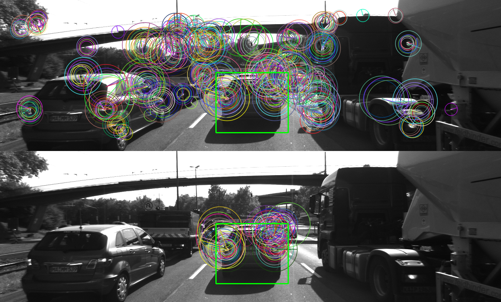

# SFND 2D Feature Tracking

<p style="color:black;font-size:14px;">

<em><br>Example: Results of SIFT keypoint detection using default parameters (1438 keypoints detected in image 0000.png in 92.523 ms)</em>
</p>
  
## Task
The idea of the camera course in Udacity's Sensor Fusion Nanodegree program is to build a collision detection system - that's the overall goal for the Final Project. As a preparation for this, you will now build the feature tracking part and test various detector / descriptor combinations to see which ones perform best. This mid-term project consists of four parts:
  
* First, you will focus on loading images, setting up data structures and putting everything into a ring buffer to optimize memory load.
* Then, you will integrate several keypoint detectors such as HARRIS, FAST, BRISK and SIFT and compare them with regard to number of keypoints and speed.
* In the next part, you will then focus on descriptor extraction and matching using brute force and also the FLANN approach we discussed in the previous lesson.
* In the last part, once the code framework is complete, you will test the various algorithms in different combinations and compare them with regard to some performance measures.
    
## Dependencies for Running Locally
* cmake >= 2.8
  * All OSes: [click here for installation instructions](https://cmake.org/install/)
* make >= 4.1 (Linux, Mac), 3.81 (Windows)
  * Linux: make is installed by default on most Linux distros
  * Mac: [install Xcode command line tools to get make](https://developer.apple.com/xcode/features/)
  * Windows: [Click here for installation instructions](http://gnuwin32.sourceforge.net/packages/make.htm)
* OpenCV >= 4.1
  * This must be compiled from source using the `-D OPENCV_ENABLE_NONFREE=ON` cmake flag for testing the SIFT and SURF detectors.
  * The OpenCV 4.1.0 source code can be found [here](https://github.com/opencv/opencv/tree/4.1.0)
* Boost C++ libraries >= 1.65.1 for circular data frame buffer implementation
* gcc/g++ >= 5.4
  * Linux: gcc / g++ is installed by default on most Linux distros
  * Mac: same deal as make - [install Xcode command line tools](https://developer.apple.com/xcode/features/)
  * Windows: recommend using [MinGW](http://www.mingw.org/)
  
## Basic Build Instructions
  
1. Install requirements.
2. Build OpenCV from source enabling the `-D OPENCV_ENABLE_NONFREE=ON` cmake flag for testing the SIFT and SURF detectors and install.
   * Howto's for OpenCV 4.1.0 and 4.1.2:
     * [How to install OpenCV 4.1.0 with CUDA 10.0 in Ubuntu distro 18.04](https://gist.github.com/DSamuylov/ebae5d4dd4e2ba6bd4af32b44cf97b98)
     * [How to install OpenCV 4.2.0 with CUDA 10.0 in Ubuntu distro 18.04](https://gist.github.com/raulqf/f42c718a658cddc16f9df07ecc627be7)
   * Remark: CUDA is not required here.
3. Clone this repo.
4. Make a build directory in the top level directory: `mkdir build && cd build`
5. Compile: `cmake .. && make`
6. Run it: `./2D_feature_tracking`.
  
# Mid-Term Project Submission
  
## Data Buffer
  
### MP.1 Data Buffer Optimization
  
_Implement a vector for dataBuffer objects whose size does not exceed a limit (e.g. 2 elements). This can be achieved by pushing in new elements on one end and removing elements on the other end._
  
#### Circular Data Buffer Implementation using Boost

As we store structured data frame objects of struct DataFame (s. [dataStructures.h](/src/dataStructures.h)) a generic ringbuffer class is needed. Boost C++ Libraries offer a generic class template of a circular ringbuffer, which meets all requirements. As boost c++ libraries are well tested and because only a one line change is needed, I have decided to choose this approach of [Boost.Circular_Buffer](https://www.boost.org/doc/libs/1_65_1/doc/html/circular_buffer.html) implementation.  
  
Check installed boost version
```
cout << "Using Boost version "
	<< BOOST_VERSION / 100000     << "."  // major version
	<< BOOST_VERSION / 100 % 1000 << "."  // minor version
	<< BOOST_VERSION % 100                // patch level
	<< endl;
```
  
Replace the following initialization in [MidTermProject_Camera_Student.cpp](/src/MidTermProject_Camera_Student.cpp):
```
vector<DataFrame> dataBuffer; // list of data frames which are held in memory at the same time (constantly growing!)
```
with:
```
boost::circular_buffer<DataFrame> dataBuffer(dataBufferSize); // create circular buffer for DataFrame structures
```
  
Print current buffer size and maximum capacity of the circular data buffer
```
cout << "Circular data buffer capacity in use = "
	<< dataBuffer.size()
	<< " of max. "
	<< dataBuffer.capacity()
	<< " data frames."
	<< endl;
```

## Keypoints / Features

### MP.2 Keypoint / Feature Detection

The following keypoint resp. feature detectors from OpenCV have been implemented:
- SHI-TOMASI (given already by Udacity code skeleton)
- HARRIS
- FAST
- BRISK
- ORB
- KAZE
- AKAZE
- SIFT (non-free!!!)
- SURF (non-free!!!)

#### Implementation of the Harris Corner Detector

<p style="color:black;font-size:14px;">

<em><br>Example: Results of HARRIS keypoint detection using default parameters (115 keypoints detected in image 0000.png in 15.845 ms)</em>
</p>
  
Find the implementation of Harris Corner Detector in [matching2D_Student.cpp](/src/matching2D_Student.cpp):
```
// detect keypoints in image using the traditional Harris corner detector
double detKeypointsHarris(vector<cv::KeyPoint> & keypoints, cv::Mat & img, bool bVis)
{
    ...
}
```
  
#### Implementation of the other Feature Detectors (FAST, BRISK, ...)

<p style="color:black;font-size:14px;">

<em><br>Example: Results of AKAZE keypoint detection using default parameters (1351 keypoints detected in image 0000.png in 59.583 ms)</em>
</p>
  
Find the implementation of the other feature detectors (FAST, BRISK, ...) in [matching2D_Student.cpp](/src/matching2D_Student.cpp):
```
// detect keypoints using different newer feature detectors from OpenCV like FAST, BRISK, ...) ... except 
// for the traditional Shi-Tomasi and Harris detectors, which are implemented separately (s. above)
double detKeypointsModern(
    std::vector<cv::KeyPoint> & keypoints, cv::Mat & img, std::string detectorType, bool bVis)
{
    ...
}
```
  
### Keypoint Filtering
  
#### Keypoint filtering using Target Bounding Boxes
  
In a potential future application of this code bounding boxes would be provided by an additional object detection CNN (e. g. bounding boxes for detected vehicles). Here a given bounding box for the target vehicle (obstacle) is used as a placeholder to filter out keypoints within this region of interest. In a later application this fixed bounding box needs to be replaced by the output of an appropriate object detector. This will be done in the next project SFND 3D Object Tracking.
  
<p style="color:black;font-size:14px;">

<em><br>Example: AKAZE keypoints before and after region-of-interest filtering using a given target bounding box</em>
</p>
  
Find the implementation of Keypoint Filtering in [MidTermProject_Camera_Student.cpp](/src/MidTermProject_Camera_Student.cpp):
```
//// STUDENT ASSIGNMENT
//// TASK MP.3 -> only keep keypoints on the preceding vehicle

// only keep keypoints on the preceding vehicle
// remark: This is a temporary solution that will be replace with bounding boxes provided by an object detection CNN!
//bool bFocusOnVehicle = true;  // true: only consider keypoints within the bounding box; false: consider all keypoints
// store bFocusOnVehicle flag in the last result ringbuffer element
(resultBuffer.end() - 1)->bFocusOnVehicle = bFocusOnVehicle;
cout << "Focus on keypoints on vehicle = " << bFocusOnVehicle << endl;
cv::Rect vehicleRect(535, 180, 180, 150);
if (bFocusOnVehicle)
{
    ...
}

// store the number of keypoints within the region of interest (target bounding box) in the last result ringbuffer element
(resultBuffer.end() - 1)->numKeypointsInROI = keypoints.size();  // equal to total number of keypoints if bFocusOnVehicle == false

//// EOF STUDENT ASSIGNMENT
```

#### Optional: Limiting the Maximum Number of Keypoints

For debugging purpose and to get a better overview of the selected keypoints an optional filter is included after applying the target bounding box selection filter that limits the maximum number of keypoints to be considered. As keypoint / feature detectors do not necessarily sort the detected keypoints, the keypoints need to be sorted by the strength of the feature detector response before limiting their number. Otherwise, keypoints with lower strength would be considered in the final selection prior to the better keypoints with a stronger feature detector response. After sorting, the first "maxKeypoints" are kept in the list, the rest is deleted.
  
<p style="color:black;font-size:14px;">

<em><br>Example: AKAZE keypoints located within a given target bounding box before and after limiting their maximum number to 50 (in this example)</em>
</p>
  
Excerpt from [matching2D.hpp](/src/matching2D.hpp):
```
bool compareKeypointResponse(const cv::KeyPoint & p1, const cv::KeyPoint & p2);
```
  
Excerpt from [matching2D_Student.cpp](/src/matching2D_Student.cpp):
```
// compare the strength of the detector response of tow different keypoints for sorting
bool compareKeypointResponse(const cv::KeyPoint & kpt1, const cv::KeyPoint & kpt2)
{
    // return true if response of kpt1 is greater than the response of kpt2, or false otherwise
    return kpt1.response > kpt2.response;
}
```
  
Find the implementation of the optional filter limiting the maximum number of keypoints find in [MidTermProject_Camera_Student.cpp](/src/MidTermProject_Camera_Student.cpp):
```
// optional : limit number of keypoints (helpful only for debugging and learning => Do not use in real application!)
//bool bLimitKpts = false;
(resultBuffer.end() - 1)->bLimitKpts = bLimitKpts;  // store bLimitKpts flag in the last result ringbuffer element
cout << "Limit number of keypoints = " << bLimitKpts << endl;
if (bLimitKpts)
{
    ...
        ...
        // sort keypoints according to the strength of the detector response (not every detector sorts the keypoints automatically!)
        sort(keypoints.begin(), keypoints.end(), compareKeypointResponse);
        
        // keep the first maxKeypoints from the list sorted by descending order of the detector response
        keypoints.erase(keypoints.begin() + maxKeypoints, keypoints.end());
        ...
    ...
}

// store the number of limited keypoints within the region of interest (target bounding box) in the last result ringbuffer element
(resultBuffer.end() - 1)->numKeypointsInROILimited = keypoints.size();  // equal to number of keypoints in ROI if bLimitKpts == false

// push keypoints and descriptor for current frame to end of data buffer
(dataBuffer.end() - 1)->keypoints = keypoints;
```

## Keypoint / Feature Descriptor Extractors
  
### MP.4 Extraction of Keypoint / Feature Descriptors
  
The following keypoint resp. feature descriptors from OpenCV have been implemented:
- BRISK (given by Udacity code skeleton)
- BRIEF
- ORB
- FREAK
- KAZE (only works with KAZE / AKAZE keypoints)
- AKAZE (only works with KAZE / AKAZE keypoints)
- SIFT (non-free!!!)
- SURF (non-free!!!)
  
#### Implementation of the Keypoint / Feature Descriptor Extractors (BRIEF, ORB, ...)

Find the implementation of the keypoint / feature descriptor extractors in [matching2D_Student.cpp](/src/matching2D_Student.cpp):
```
// use one of several types of state-of-art descriptors to uniquely identify keypoints
double descKeypoints(
    vector<cv::KeyPoint> & keypoints, cv::Mat & img, cv::Mat & descriptors, string descExtractorType)
{
    ...
}
```
  
### MP.5 and MP.6 Descriptor Matching
  
#### Adding FLANN-based Keypoints Matching and K-Nearest Neighbor Selection with Descriptor Distance Ratio Test
  
An implementation of brute force keypoint matching with an nearest neighbor search strategy to find the best match was already given by the code skeleton provided by Udacity. A FLANN-based keypoints matcher using KD-tree approach with k-nearest neighbor search to find the best match has been added to the code (s. next section). Some sample results for SIFT keypoints are shonw in the image.
  
Find the implementation of FLANN-based keypoint matching and K-nearest neighbor selection with descriptor distance ration test in [matching2D_Student.cpp](/src/matching2D_Student.cpp):
```
// find best matches for keypoints in two camera images based on several matching methods
double matchDescriptors(
    std::vector<cv::KeyPoint> & kPtsSource, std::vector<cv::KeyPoint> & kPtsRef, cv::Mat & descSource, cv::Mat & descRef,
    std::vector<cv::DMatch> & matches, std::string descriptorType, std::string matcherType, std::string selectorType)
{
    ...
}
```

#### MP.5 FLANN-based Keypoint Matching

_TASK MP.5 -> Add FLANN matching in file matching2D.cpp as a more time efficient method compared to brute-force matching._
  
<p style="color:black;font-size:14px;">

<em><br>Example: FLANN-based matching of SIFT keypoints (with BRISK descriptors) located within a given target bounding box using nearest neighbor selection</em>
</p>
  
Above image shows two subsequent image frames plotted besides one another. The left side of the image shows the image frame captured first, the right side of the image shows the sub-sequent image frame. The keypoints found within the rectangular target bounding box (using SIFT in this example) have been marked. For each of those keypoints a descriptor has been calculated (using BRISK in this example).
Afterwards, FLANN-based matching with nearest neighbor selection has been applied to match the keypoint descriptors in the left image with similar ones in the right image. This may also lead to some false positive matches.
  
False postive matches can be recognized by non-horizontal connection lines between keypoints in the left and the right image, for instance. Such false positives are easy to spot for a human eye. However, some other false positive matches may in fact have horizontal connection lines, but they do not end at the right spot. Such false positives are more difficult to recognize at one glance.

#### MP.6 Descriptor Distance Ratio Test als False Positive Filter

_TASK MP.6 -> Add KNN match selection and perform descriptor distance ratio filtering with t=0.8 in file matching2D.cpp in order to reduce the number of false postive matches._
  
<p style="color:black;font-size:14px;">  

<em><br>Example: FLANN-based matching of SIFT keypoints (with BRISK descriptors) located within a given target bounding box using k-nearest neighbor selection (k = 2) and distance ratio test (minDescDistRatio = 0.8)</em>
<em><br>
  
Above image shows two subsequent image frames plotted besides one another. The left side of the image shows the image frame captured first, the right side of the image shows the sub-sequent image frame. The keypoints found within the rectangular target bounding box (using SIFT in this example) have been marked. For each of those keypoints a descriptor has been calculated (using BRISK in this example).
Afterwards, FLANN-based matching has been applied to match the keypoint descriptors in the left image with similar keypoint descriptors in the right image. K-nearest neightbor (k=2) search has then been applied to select the k best choices. This allows two possible options in this case.
  
A subsequent filtering step based on a descriptor distance ratio test with a threshold of 0.8 has been used afterwards to reduce the number of false positive matches.  
  
When comparing the results of FLANN-based keypoints matching with k-nearest neighbor search and descriptor distance ratio filtering (s. image above) with FLANN-based keypoint matching and nearest neigbor search (s. image from the previous section) one realizes that the descriptor distance ratio test effectively reduces false positive matches. In this example, it removes all false positive matches, but this is not necessarily the case in general.

## Performance

### Configuration

#### Allowed Settings for Keypoint Detector, Keypoint Descriptor and Matcher

### MP.7 - Performance Evaluation w. r. t. Total Number of Detected Keypoints

_TASK MP.7 -> For all implemented keypoint detectors: Count the number of keypoints on the preceding vehicle for all 10 images and take note of the distribution of their neighborhood size._
  
<p style="color:black;font-size:14px;">

<em><br>Example: SHI-TOMASI keypoints before and after region-of-interest filtering using a given target bounding box for the leading vehicle</em>
</p>
  
<p style="color:black;font-size:14px;">

<em><br>Example: HARRIS keypoints before and after region-of-interest filtering using a given target bounding box for the leading vehicle</em>
</p>
  
<p style="color:black;font-size:14px;">

<em><br>Example: FAST keypoints before and after region-of-interest filtering using a given target bounding box for the leading vehicle</em>
</p>
  
<p style="color:black;font-size:14px;">

<em><br>Example: BRISK keypoints before and after region-of-interest filtering using a given target bounding box for the leading vehicle</em>
</p>
  
<p style="color:black;font-size:14px;">

<em><br>Example: ORB keypoints before and after region-of-interest filtering using a given target bounding box for the leading vehicle</em>
</p>
  
<p style="color:black;font-size:14px;">

<em><br>Example: KAZE keypoints before and after region-of-interest filtering using a given target bounding box for the leading vehicle</em>
</p>
  
<p style="color:black;font-size:14px;">

<em><br>Example: AKAZE keypoints before and after region-of-interest filtering using a given target bounding box for the leading vehicle</em>
</p>
  
<p style="color:black;font-size:14px;">

<em><br>Example: SIFT keypoints before and after region-of-interest filtering using a given target bounding box for the leading vehicle</em>
</p>
  
<p style="color:black;font-size:14px;">

<em><br>Example: SIFT keypoints before and after region-of-interest filtering using a given target bounding box for the leading vehicle</em>
</p>
  
|image no.|SHI-TOMASI|HARRIS|FAST|BRISK|ORB|KAZE|AKAZE|SIFT|SURF|
|:-:|:-:|:-:|:-:|:-:|:-:|:-:|:-:|:-:|:-:|
|0000.png|125|17|419|264|92|206|166|138|205|
|0001.png|118|14|429|282|102|184|157|132|198|
|0002.png|123|18|404|282|106|197|161|124|208|
|0003.png|120|21|423|277|113|193|155|137|210|
|0004.png|120|26|386|297|109|199|163|134|201|
|0005.png|113|43|414|297|125|193|164|140|220|
|0006.png|114|18|418|289|130|207|173|137|241|
|0007.png|123|31|406|272|129|211|175|148|227|
|0008.png|111|26|396|267|127|220|177|159|218|
|0009.png|112|34|401|254|128|216|179|137|222|
|cumulated sum|1179|248|4094|2763|1161|2026|1670|1386|2150|

Table 1: Keypoints on target vehicle for different detector types
  
### MP.8 - Performance Evaluation w. r. t. Number of Keypoint Matches
  
_TASK MP.8 -> Count the number of matched keypoints for all 10 images using all possible combinations of detectors and descriptors. In the matching step, the BF approach is used with the descriptor distance ratio set to 0.8._
  
|id|detector|descriptor|cumulated sum of matched keypoints in ROI|
|:-:|:-:|:-:|:-:|
|1|SHITOMASI|BRISK|767|
|2|SHITOMASI|BRIEF|944|
|3|SHITOMASI|ORB|908|
|4|SHITOMASI|FREAK|768|
|5|SHITOMASI|KAZE|n. a.|
|6|SHITOMASI|AKAZE|n. a.|
|7|SHITOMASI|SIFT|927|
|8|SHITOMASI|SURF|496|
|9|HARRIS|BRISK|142|
|10|HARRIS|BRIEF|173|
|11|HARRIS|ORB|162|
|12|HARRIS|FREAK|144|
|13|HARRIS|KAZE|n. a.|
|14|HARRIS|AKAZE|n. a.|
|15|HARRIS|SIFT|163|
|16|HARRIS|SURF|123|
|17|FAST|BRISK|2183|
|18|FAST|BRIEF|2831|
|19|FAST|ORB|2768|
|20|FAST|FREAK|2233|
|21|FAST|KAZE|n. a.|
|22|FAST|AKAZE|n. a.|
|23|FAST|SIFT|2782|
|24|FAST|SURF|1710|
|25|BRISK|BRISK|1570|
|26|BRISK|BRIEF|1704|
|27|BRISK|ORB|1516|
|28|BRISK|FREAK|1524|
|29|BRISK|KAZE|n. a.|
|30|BRISK|AKAZE|n. a.|
|31|BRISK|SIFT|1648|
|32|BRISK|SURF|1459|
|33|ORB|BRISK|751|
|34|ORB|BRIEF|545|
|35|ORB|ORB|763|
|36|ORB|FREAK|420|
|37|ORB|KAZE|n. a.|
|38|ORB|AKAZE|n. a.|
|39|ORB|SIFT|763|
|40|ORB|SURF|730|
|41|KAZE|BRISK|1386|
|42|KAZE|BRIEF|1267|
|43|KAZE|ORB|1327|
|44|KAZE|FREAK|1311|
|45|KAZE|KAZE|1393|
|46|KAZE|AKAZE|1615|
|47|KAZE|SIFT|1575|
|48|KAZE|SURF|1259|
|49|AKAZE|BRISK|1215|
|50|AKAZE|BRIEF|1266|
|51|AKAZE|ORB|1182|
|52|AKAZE|FREAK|1187|
|53|AKAZE|KAZE|n. a.|
|54|AKAZE|AKAZE|1259|
|55|AKAZE|SIFT|1270|
|56|AKAZE|SURF|1090|
|57|SIFT|BRISK|592|
|58|SIFT|BRIEF|702|
|59|SIFT|ORB|n. a.|
|60|SIFT|FREAK|593|
|61|SIFT|KAZE|n. a.|
|62|SIFT|AKAZE|n. a.|
|63|SIFT|SIFT|800|
|64|SIFT|SURF|499|
|65|SURF|BRISK|1395|
|66|SURF|BRIEF|1510|
|67|SURF|ORB|1387|
|68|SURF|FREAK|1220|
|69|SURF|KAZE|n. a.|
|70|SURF|AKAZE|n. a.|
|71|SURF|SIFT|1504|
|72|SURF|SURF|1410|
  
Table 2: Sum of matched keypoints over 10 images for different detector - descriptor combinations
  
Remarks:
* KAZE or AKZE descriptor extractors only work with KAZE or AKAZE keypoints
* AKAZE/KAZE does not provide any keypoint matches
* SIFT/ORB is not available due to memory allocation error (out of memory)
* Use DES_HOG seting and L2 norm when SIFT is used as descriptor extractor
* USe DES_BINARY and Hamming norm for all other descriptor extractors in table 2
  
### MP.9 - Performance Evaluation w. r. t. Processing Time
  
_TASK MP.9 -> Log the time it takes for keypoint detection and descriptor extraction. The results must be entered into a spreadsheet. Based on this information suggest the TOP3 detector / descriptor combinations as the best choice for our purpose of detecting keypoints on vehicles, and justify the choice based on the obervations collected during the experiments with the code._ 
  
|id|detector|descriptor|average time for keypoint detection (all keypoints) in [s]|average time for descriptor extraction (only ROI) in [s]|sum in [s]|
|:-:|:-:|:-:|:-:|:-:|:-:|
|1|SHITOMASI|BRISK|0.00992294|0.0011668|0.0110897|
|2|SHITOMASI|BRIEF|0.0101598|0.000671191|0.010831|
|3|SHITOMASI|ORB|0.0111797|0.00088047|0.0120601|
|4|SHITOMASI|FREAK|0.00932816|0.0289397|0.0382678|
|5|SHITOMASI|KAZE|0.00892846|n. a.|0.00892846|
|6|SHITOMASI|AKAZE|0.00900204|n. a.|0.00900204|
|7|SHITOMASI|SIFT|0.00904322|0.0128401|0.0218834|
|8|SHITOMASI|SURF|0.00925512|0.00837263|0.0176278|
|9|HARRIS|BRISK|0.0110322|0.000383484|0.0114157|
|10|HARRIS|BRIEF|0.0108038|0.000249165|0.011053|
|11|HARRIS|ORB|0.0114891|0.000759412|0.0122486|
|12|HARRIS|FREAK|0.0109141|0.0285439|0.0394579|
|13|HARRIS|KAZE|0.0107718|n. a.|0.0107718|
|14|HARRIS|AKAZE|0.0109774|n. a.|0.0109774|
|15|HARRIS|SIFT|0.011084|0.0122815|0.0233654|
|16|HARRIS|SURF|0.0107034|0.000448322|0.0111517|
|17|FAST|BRISK|0.00156304|0.00351379|0.00507683|
|18|FAST|BRIEF|0.00160263|0.00122319|0.00282581|
|19|FAST|ORB|0.00160801|0.00124263|0.00285064|
|20|FAST|FREAK|0.00163918|0.0293925|0.0310317|
|21|FAST|KAZE|0.0016293|n. a.|0.0016293|
|22|FAST|AKAZE|0.00156401|n. a.|0.00156401|
|23|FAST|SIFT|0.00170191|0.018932|0.0206339|
|24|FAST|SURF|0.00161111|0.00261055|0.00422166|
|25|BRISK|BRISK|0.0341762|0.00247697|0.0366532|
|26|BRISK|BRIEF|0.0340037|0.0008503|0.034854|
|27|BRISK|ORB|0.0340415|0.00361263|0.0376542|
|28|BRISK|FREAK|0.0340036|0.0284044|0.062408|
|29|BRISK|KAZE|0.0340888|n. a.|0.0340888|
|30|BRISK|AKAZE|0.0339574|n. a.|0.0339574|
|31|BRISK|SIFT|0.0340233|0.0256407|0.059664|
|32|BRISK|SURF|0.034207|0.00556385|0.0397708|
|33|ORB|BRISK|0.00600783|0.00112311|0.00713094|
|34|ORB|BRIEF|0.00605807|0.000505837|0.00656391|
|35|ORB|ORB|0.00611763|0.00403414|0.0101518|
|36|ORB|FREAK|0.00614149|0.0281819|0.0343234|
|37|ORB|KAZE|0.00612611|n. a.|0.00612611|
|38|ORB|AKAZE|0.00610039|n. a.|0.00610039|
|39|ORB|SIFT|0.00591103|0.0288008|0.0347118|
|40|ORB|SURF|0.00592968|0.00981508|0.0157448|
|41|KAZE|BRISK|0.242002|0.00190729|0.243909|
|42|KAZE|BRIEF|0.244661|0.000892902|0.245554|
|43|KAZE|ORB|0.241535|0.00290303|0.244438|
|44|KAZE|FREAK|0.23861|0.0317736|0.270384|
|45|KAZE|KAZE|0.244794|0.180457|0.425251|
|46|KAZE|AKAZE|0.235028|0.0360212|0.271049|
|47|KAZE|SIFT|0.234152|0.0182326|0.252385|
|48|KAZE|SURF|0.241052|0.0021295|0.243182|
|49|AKAZE|BRISK|0.0441857|0.00153996|0.0457256|
|50|AKAZE|BRIEF|0.0449493|0.000653649|0.0456029|
|51|AKAZE|ORB|0.0457351|0.00236476|0.0480999|
|52|AKAZE|FREAK|0.0436624|0.0281806|0.071843|
|53|AKAZE|KAZE|0.0439384|0.170445|0.214384|
|54|AKAZE|AKAZE|0.0439305|0.0313994|0.0753299|
|55|AKAZE|SIFT|0.0415269|0.0176723|0.0591992|
|56|AKAZE|SURF|0.0453478|0.00152355|0.0468713|
|57|SIFT|BRISK|0.0827728|0.00126937|0.0840421
|58|SIFT|BRIEF|0.0852351|0.000602705|0.0858378|
|59|SIFT|ORB|0.0859266|n. a.|0.0859266|
|60|SIFT|FREAK|0.0830509|0.0312343|0.114285|
|61|SIFT|KAZE|0.0856125|n. a.|0.0856125|
|62|SIFT|AKAZE|0.0861189|n. a.|0.0861189|
|63|SIFT|SIFT|0.0733221|0.0650336|0.138356|
|64|SIFT|SURF|0.0863601|0.00121667|0.0875768|
|65|SURF|BRISK|0.0353584|0.00189932|0.0372577|
|66|SURF|BRIEF|0.0354241|0.000702735|0.0361269|
|67|SURF|ORB|0.0352486|0.00274842|0.037997|
|68|SURF|FREAK|0.0347923|0.0297151|0.0645074|
|69|SURF|KAZE|0.0355306|n. a.|0.0355306|
|70|SURF|AKAZE|0.0357105|n. a.|0.0357105|
|71|SURF|SIFT|0.0335696|0.043584|0.0771537|
|72|SURF|SURF|0.035458|0.00660682|0.0420648|
  
Table 3: Average processing time for keypoint detection and descriptor extraction over 10 images for different detector - descriptor combinations
  
### Final Preferrence
When taking the cumulated number of descriptor matches on the target vehicle and the processing time for keypoint detection and descriptor extraction as a selection criterion the following three detector / descriptor combinations would be my preference:
  
|id|detector|descriptor|cumulated sum of matched keypoints in ROI|average processing time for keypoint detection and descriptor extraction sum in [s]|
|:-:|:-:|:-:|:-:|:-:|
|18|FAST|BRIEF|2831|0.00282581|
|19|FAST|ORB|2768|0.00285064|
|17|FAST|BRISK|2183|0.00507683|
  
Table 4: Number of descriptor matches and processing time for keypoint detection and descriptor extraction of the preferred variants
  
Below images show descriptor matching between image 0000.png and 0001.png for using the three detector-descriptor combination from table 4.
We can see that the keypoints, which FAST provides within the bounding box around the target vehicle, are mainly located around the target vehicle's outer countour and for great part also lie directly on the target vehicle. So this result does not contradict to use FAST as a feature detector for this task.
The images below also show that descriptor matching looks ok in all three cases as there seem to be not many false positives (e. g. diagonal connection lines). What concerns the latter issue the combination FAST and BRIEF might yield less false positives than the combination FAST and BRISK, but this is hard to tell in general from just one or a few examples.
  
<p style="color:black;font-size:14px;">

<em><br>Example: BF matching with KNN selection (k=2) of FAST keypoints with BRISK descriptors</em>
</p>
  
<p style="color:black;font-size:14px;">

<em><br>Example: BF matching with KNN selection (k=2) of FAST keypoints with BRIEF descriptors</em>
</p>
  
<p style="color:black;font-size:14px;">

<em><br>Example: BF matching with KNN selection (k=2) of FAST keypoints with ORB descriptors</em>
</p>
  
So the preferred keypoint detector / descriptor combinations would be: __FAST/BRISK__, __FAST/BRIEF__, __FAST/ORB__.
  
# Reference

[1]: Jianbo Shi and Carlo Tomasi. Good features to track. In Computer Vision and Pattern Recognition, 1994. Proceedings CVPR'94., 1994 IEEE Computer Society Conference on, pages 593–600. IEEE, 1994.
  
[2]: Chris Harris and Mike Stephens. A Combined Corner and Edge Detector. In Proceedings of the Alvey Vision Conference 1998, pages 23.1-23.6. Alvey Vision Club, September 1998.
  
[3]: Edward Rosten and Tom Drummond. Machine learning for high-speed corner detection. In Computer Vision–ECCV 2006, pages 430–443. Springer, 2006.
  
[4]: Stefan Leutenegger, Margarita Chli, and Roland Yves Siegwart. Brisk: Binary robust invariant scalable keypoints. In Computer Vision (ICCV), 2011 IEEE International Conference on, pages 2548–2555. IEEE, 2011.
  
[5]: Michael Calonder, Vincent Lepetit, Christoph Strecha, and Pascal Fua. Brief: Binary robust independent elementary features. In Computer Vision–ECCV 2010, pages 778–792. Springer, 2010.
  
[6]: Ethan Rublee, Vincent Rabaud, Kurt Konolige, and Gary Bradski. Orb: an efficient alternative to sift or surf. In Computer Vision (ICCV), 2011 IEEE International Conference on, pages 2564–2571. IEEE, 2011.
  
[7]: Alexandre Alahi, Raphael Ortiz, and Pierre Vandergheynst. Freak: Fast retina keypoint. In Computer Vision and Pattern Recognition (CVPR), 2012 IEEE Conference on, pages 510–517. Ieee, 2012.
  
[8]: Pablo Fernández Alcantarilla, Adrien Bartoli, and Andrew J Davison. Kaze features. In Computer Vision–ECCV 2012, pages 214–227. Springer, 2012.
  
[9]: Pablo F Alcantarilla, Jesús Nuevo, and Adrien Bartoli. Fast explicit diffusion for accelerated features in nonlinear scale spaces. Trans. Pattern Anal. Machine Intell, 34(7):1281–1298, 2011.
  
[10]: David G Lowe. Distinctive image features from scale-invariant keypoints. International journal of computer vision, 60(2):91–110, 2004.
  
[11]: Herbert Bay, Tinne Tuytelaars, and Luc Van Gool. Surf: Speeded up robust features. Computer Vision–ECCV 2006, pages 404–417, 2006.
  
